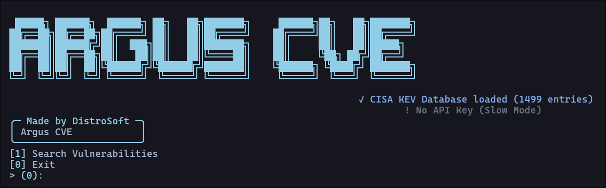

# 🛡️ Argus CVE - Vulnerability Intelligence Tool

**Argus CVE** is a powerful vulnerability research and analysis tool designed for DevSecOps professionals and security researchers. It provides real-time access to the **NIST National Vulnerability Database (NVD)** and correlates results with the **CISA KEV** catalog to highlight threats that are actively being exploited in the wild.

---

## 🧐 What is a CVE? (For Beginners)

If you are new to cybersecurity, a **CVE** (Common Vulnerabilities and Exposures) is a unique identifier for a specific security hole found in software or hardware.
- **The Score (CVSS)**: A numerical rating from 0 to 10. A **10.0** represents a critical threat that is easy to exploit.
- **CISA KEV**: This is the "Gold Standard" list of vulnerabilities that hackers are **actually using** right now. **Argus CVE** automatically flags these as "ACTIVE" so you know what to patch first.

---

## 📸 Preview



---

## ✨ Key Features

* 🔍 **Smart Search**: Filter by keywords (e.g., 'wordpress', 'fortinet'), severity, and date ranges.
* ⚠️ **CISA KEV Integration**: Instant identification of "Known Exploited" vulnerabilities.
* 🚀 **High-Performance**: Supports NVD API keys to increase request speeds (Fast Mode).
* 📊 **Beautiful UI**: Dynamic terminal dashboards powered by the `Rich` library.
* 📝 **Report Exporting**: Save findings as **JSON** for data analysis or **Markdown** for professional audit reports.

---

## ⚙️ Installation

Follow these steps to get Argus CVE running on your local machine:

### 1. Clone the Repository
```bash
git clone https://github.com/Distrosoft-Dev/Argus_CVE
cd Argus-CVE
```

### 2. Set up a Virtual Environment (venv)
#### Windows
```powershell
python -m venv venv
.\venv\Scripts\activate
```

#### Linux / MacOS
```bash
python3 -m venv venv
source venv/bin/activate
```

### 3. Install Requirements
```shell
pip install -r requirements.txt
```

---

## 🚀 How to Use
### With interactive dashboard
```shell
python argus_cve.py
```

### With CLI mode
```shell
python argus_cve.py -k apache -d 14 -s 1
```

### You need help ??
```shell
python argus_cve.py --help
```
